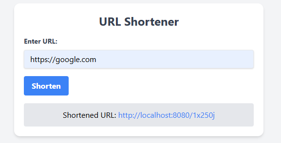

# URL Shortener

A simple yet powerful URL shortener built with Go, HTMX, and Tailwind CSS, designed to be responsive and easy to use. This application provides a user-friendly interface for quickly shortening long URLs, ideal for personal or small business use.

## Features

- **Shorten URLs**: Convert long URLs into short, manageable links.
- **Responsive UI**: Mobile-friendly interface using Tailwind CSS.
- **Easy Integration**: Designed to run with Docker for easy setup and scalability.
- **Real-time Interaction**: Utilizes HTMX to handle form submissions without full page reloads.

## Technology Stack

- **Backend**: Go (Golang)
- **Frontend**: HTMX and Tailwind CSS for styling
- **Database**: PostgreSQL
- **Containerization**: Docker

## Getting Started

These instructions will get you a copy of the project up and running on your local machine for development and testing purposes.

### Prerequisites

- Docker
- Docker Compose

### Installation

1. **Clone the repository**
   ```bash
   git clone https://github.com/papaaannn/url-shortener.git
   cd urlshortener
   ```
2. **Build and run the Docker containers**
   ```bash
   docker-compose up --build
   ```
3. **Access the application**
   Navigate to `http://localhost:8080` in your web browser to access the URL shortener.

## Usage

To shorten a URL, simply enter the URL into the input field on the homepage and click "Shorten". The shortened URL will be displayed below the form, which can be copied and used as needed.

## Development

### Folder Structure

- `src/`: Contains all Go source files.
  - `main.go`: The entry point of the application.
  - `handlers.go`: HTTP request handlers.
  - `models.go`: Data models.
- `templates/`: HTML templates for the frontend.
- `Dockerfile`: Docker configuration for building the Go application.
- `docker-compose.yml`: Docker Compose configuration for orchestrating multiple containers.

### Making Changes

To make changes to the application, update the Go files or templates as needed, then rebuild the Docker containers:

    docker-compose down
    docker-compose up --build

## License

This project is licensed under the MIT License - see the [LICENSE.md](LICENSE.md) file for details.

## Screenshots

Include some screenshots of your project in action: 
